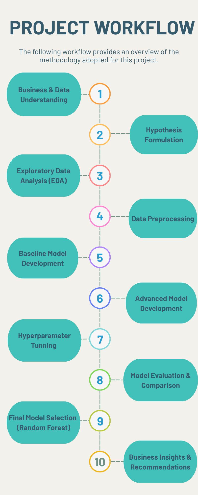
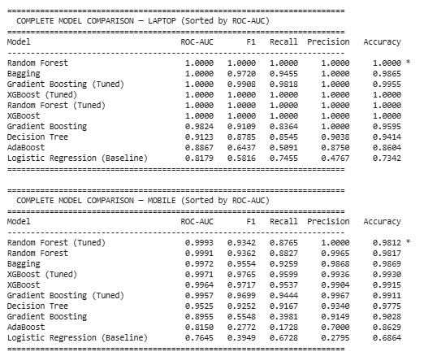
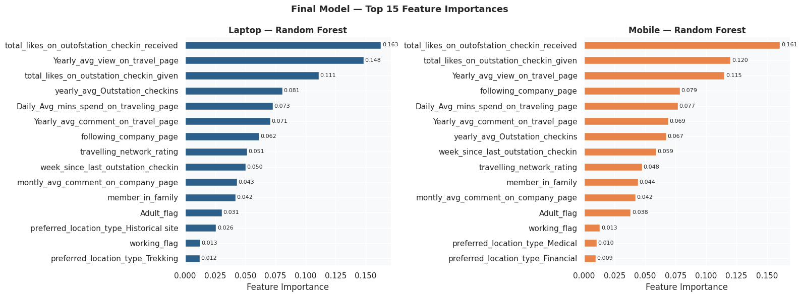
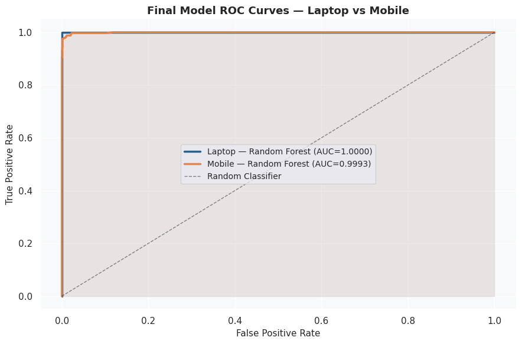
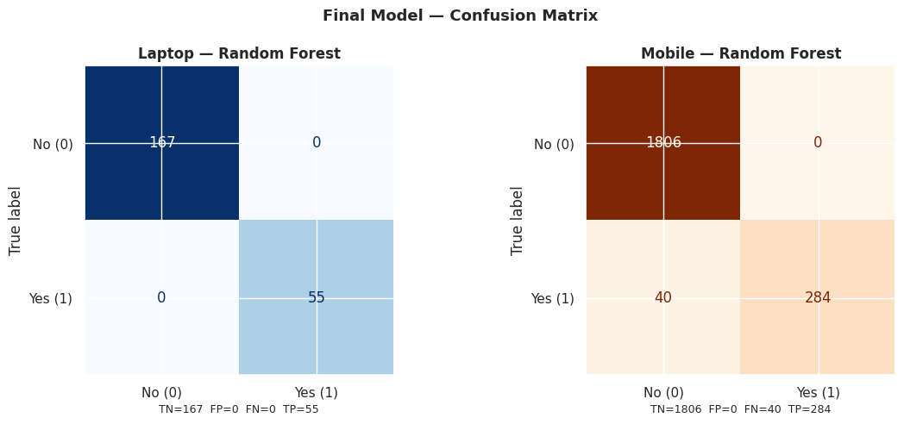

# ✈️ Flight Booking Purchase Prediction using Machine Learning

## 📌 Project Overview

This project predicts whether a customer is likely to purchase a travel product based on behavioural, engagement, and travel-related data. Separate machine learning models were developed for Laptop and Mobile users to identify potential buyers and support data-driven marketing decisions.

---

## 🎯 Business Problem

Travel companies spend significant resources on marketing campaigns without knowing which customers are most likely to convert. This project helps identify potential buyers, enabling businesses to improve campaign targeting, optimize marketing expenditure, and increase conversion rates.

---

## 📊 Dataset

| Attribute | Details |
|----------|---------|
| Total Records | 11,760 |
| Features | 17 |
| Target Variable | Taken_product (Yes/No) |
| Positive Class | 16.1% |

---

## 🛠️ Tech Stack

**Programming Language**

- Python

**Libraries**

- Pandas
- NumPy
- Matplotlib
- Seaborn
- Scikit-learn
- XGBoost

**Development Environment**

- Google Colab

---

## 🔄 Project Framework

---

## 🤖 Machine Learning Models

### Baseline Model
- Logistic Regression

### Advanced Models
- Decision Tree
- Random Forest
- AdaBoost
- Gradient Boosting
- Bagging Classifier
- XGBoost

### Hyperparameter Tuning
- RandomizedSearchCV
- Stratified K-Fold Cross Validation

---

## 📈 Final Model Performance

| Metric | Laptop | Mobile |
|---------|--------:|--------:|
| ROC-AUC | **1.0000** | **0.9993** |
| Accuracy | **1.0000** | **0.9812** |
| Precision | **1.0000** | **1.0000** |
| Recall | **1.0000** | **0.8765** |
| F1-Score | **1.0000** | **0.9342** |

### Performance Improvement over Baseline

| Device | Baseline ROC-AUC | Final ROC-AUC |
|---------|-----------------:|--------------:|
| Laptop | 0.8179 | **1.0000** |
| Mobile | 0.7645 | **0.9993** |

---

## 📊 Model Evaluation & Comparison

---

## 🌟 Feature Importance (Final Random Forest Model)

The Random Forest model identified customer engagement and travel behaviour features as the most influential predictors of purchase propensity.

---

## 📈 ROC Curve

---

## 📉 Confusion Matrix

---

## 💡 Key Findings

- Customer engagement features were the strongest predictors of purchase behaviour.
- Separate models for Laptop and Mobile users improved predictive performance.
- Ensemble learning models significantly outperformed the baseline Logistic Regression model.
- Random Forest was selected as the final model based on overall predictive performance.
- The proposed solution can support more effective customer targeting and marketing optimization.

---

## 💼 Business Recommendations

- Prioritize highly engaged customers for marketing campaigns.
- Develop separate targeting strategies for Laptop and Mobile users.
- Use predictive lead scoring to identify customers with high purchase propensity.
- Periodically retrain the model using updated customer behaviour data.

---
## 📌 Acknowledgement

This repository showcases my **Capstone Project** completed as part of the **Post Graduate Program in Data Science**. The dataset was provided as part of the capstone project, while the end-to-end analysis, data preprocessing, feature engineering, machine learning model development, evaluation, and project documentation presented in this repository were completed as part of the project.

---

## 👩‍💻 Author

**Aishwarya Kulkarni**

Aspiring Data Analyst | Machine Learning Enthusiast

**Skills:** Python • SQL • Tableau • Machine Learning • Data Analysis • Statistics • Business Analytics
           
